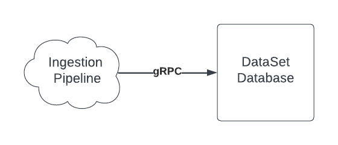

## Coding Questions <a id="old"></a>

Below are questions that went obsolete because of either we got bored of it or
did not prove to be relevant.

Guidelines:

- Around 5-10 minutes per question.
- Write in any language such as Python/C/Java/C# or pseudo code
- Don’t use any non-trivial library functions or helper code
  (e.g., using max as a macro or utility function is OK but using ‘log’ isn’t OK)

1. **The closest power of 2**

Implement a function that given a number identifies the **closest** power of 2 to that
number. For example, the closest power of 2 from 100 is 128, and the closest power
of 2 to 70 is 64. Please handle edge cases and avoid using the Log function.

2. **Second largest value**

Given a fixed array of integers, find the second largest integer by value in a single
pass.
Work with an array like this:
int nums[n] or in python nums = [5, 4, 8, 3, 9, 1] the 2nd largest is 8
For input [5,5,4,3] the 2nd largest is 4

3. **Height of Tree**

Given a binary tree, write a function that returns the height of the binary tree
(number of vertexes or number of arches)

_You can use the following notation if it helps (C like syntax):_

```c
typedef struct tree_el
{
struct tree_el *left;
struct tree_el *right
void \*data;
} tree;

int height(tree \*t);
```

_Or this python notation:_

```python
class Tree(object):
    def __init__(self):
        self.left = None
        self.right = None
        self.data = None

```

```java

Class Node {
	public int data;
	publicNode right;
	public Node left;

	Node(int data, Node right, Node left)
	{
		this.data = data;
		this.right = right;
		this.left = left;
	}
}

class Solution {
 	public int height(Node T) {
    If (T == null) {
        return 0;
    }
        return Math.max(height(T.right),height(T.left)) + 1;
    }
}

```



4. **Loop in a Linked List**

Given a linked list like the following, identify whether there is a loop in the
list without changing it and without using an external data structure.
Tip: you can use two “pointers” to the list that advance differently.

```c
typedef struct node_s
{
struct node_s *next;
void *data;
} node;

int containsLoop(node *n);
```

The last node in a non loop case points to NULL.

Or this python notation:

```python
class Node(object):
    def **init**(self):
        self.next = None
        self.data = None
```

The last node in a non loop case points to None.

5. **Array Binary Addition**

Given two arrays A and B of n size, containing either 0 or 1 as a value in their
fields. Write a program to create binary addition operations on A and B. Write the
result in array C of size n+1

6. **Palindrome**

A palindrome is a word which reads the same backward as forward, such as madam, bob.

The algorithm should ignore white-space so “race car“ is a valid palindrome.
Don’t use additional memory.

7. **Fibonacci**

Write a method to generate the nth Fibonacci number.
1,1,2,3,5,8,13,21,...

8. **Running Sum of 1D Array**

Given an array nums. We define a **running sum** of an array as runningSum[i] = sum(nums[0]…nums[i]).
Return the running sum of nums.
**Example 1:**
Input: nums = [1,2,3,4]
Output: [1,3,6,10]
Explanation: Running sum is obtained as follows: [1, 1+2, 1+2+3, 1+2+3+4].

## Get, Set, Set-All <a id="#get"></a>

**Level: M**

Define a class of a data structure working in with the following API:

1. Get(index i) → Obj - Get an object from position i.
2. Set(i, Obj) - Set an object at position i.
3. SetAll(Obj) - Set an object at all positions.

Example:
[0, 0, 0]
Set(1, 2)
Get(1) : 2
Get(2) : 0
SetAll(3)
Get(1): 3
Set(0, 1)
Get(0): 1
Get(2): 3

Description: Candidate will try to initialize the array or solve it with booleans or
counters, at the end the best and most accurate solution will be with timestamps.
When you ask the candidate the question, try to understand how well he understands
the basic data structure. Some candidates go directly to complex data structures
like Hash or LinkList or ArrayList and miss that it's a simple Array.

The main idea is to use timestamps when setting or getting a value.

On “set” we store near the value a timestamp (2 dimensional array- 2xN)
On “set all” we store near the “setall” variable another variable with setall timestamp
On “get” we compare the timestamp of the local value vs the timestamp of set all, that way we can know which value we should return.

**Common Pitfalls: map vs. array**

- Both map and array can be used to solve this. The correct solution depends on requirements. Ideally, the candidate should ask about the range of positions himself/herself (or clearly express the assumption) and we should not specify it initially.

  - If they use an array, ask about a solution with a wide range of positions, including negative numbers.
  - If they use a map, have them explain the downsides of that: hash maps have O(1) get/set complexity, but are still slower than a plain array. Hash maps will also use more memory than an array, unless the position range is sparse.

- **Follow-up Questions**

- Achieving O(1)-like performance of setall by clearing the map is an easy way out, but it’s not good enough. Technically, memory deallocation caused by clearing/reassigning the map can be O(1), because it may not take linearly more time with relation to map item count, but memory (de)allocations are generally very slow and should be avoided if possible.
- If they use timestamps, have them think about scenarios when the timestamp would not work, and have them suggest an alternative. If they don’t use timestamps, have them consider timestamps.
  - Timestamp resolution: unless it’s in e.g. nanoseconds, it becomes very easy to not know what happened earlier, because timestamps will easily be identical.
  - Non-monotonic clock: if ordinary system (real) time is used, it can be set to a lower value at any moment. OSes typically offer a monotonic clock (e.g. implemented using time since system boot) that is guaranteed to only increment.
- How do hash collisions affect the performance of hash maps? What kind of behavior would you expect from a hash map where the hash function returns a constant behavior? (Answer: hash maps have a linked list in each cell of the hash table. An entirely broken hash map will end up doing a linear search of O(n) for get and set).

Another good solution:
The idea behind is

```java
private static class EladY {
    private boolean isSetAll = false;
    private Map<Integer, Integer> map = new HashMap<>();
    private final List<Integer> list;
    private int setAllVal = 0;

    public EladY(List<Integer> listIn) {
        list = listIn;
    }

    public void set(int idx, int val) {
        if (isSetAll) {
            map.put(idx, val);
        }
        list.set(idx, val);
    }

    public int get(int idx) {
        if (isSetAll) {
            return map.get(idx) == null ? setAllVal : map.get(idx);
        } else {
            return list.get(idx);
        }
    }

    public void setAll(int val) {
        isSetAll = true;
        setAllVal = val;
        map = new HashMap<>();
    }

    public void print() {
        for (int i = 0; i < list.size(); i++) {
            System.out.print(get(i) + ",");
        }
    }
}

```
