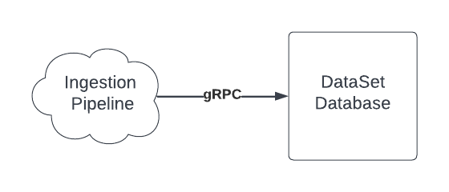

# Ingestion System Design

At DataSet we ingest dozens of PB a day of data. In order to do this, we need an ingestion system that is scalable, low-latency, and highly available. Design a system that meets the following requirements:

- Data is ingested over HTTPS
- Need to support multiple data formats (JSON, Protobuf, plain text)
- Convert ingestion data format to DataSet event format and send data to DataSet database over gRPC. DataSet database ingestion node may back pressure or have other errors. DataSet database response time is 100s of ms.
- High throughput: 50 MB/sec per client
- Low latency client response time (< 100 ms)
- Highly available, especially during deploy times
- Supports authentication
- Supports rate limiting
- Support duplicate batch detection (nice to have)

Create a block diagram system design for the Ingestion Pipeline bubble in draw.io.

## Expectations

Solution should cover

- Support parallel batches per connection for increased throughput.
- Should discuss client batching and batch sizes for increased throughput.
- Discuss where data conversion from JSON/Protobuf to EventDB event is performed and pros and cons of each. Could be performed either before or after queueing.
- Discuss how to achieve low latency
- Durability after OK sent to client to not lose events
- Compression
- Auth Server or Auth API
- Rate limiting - local, global, number of requests, total byes ingested
- Back pressure, error handling
- Client retries
- Queueing layer
- Handle EventDB back pressure

