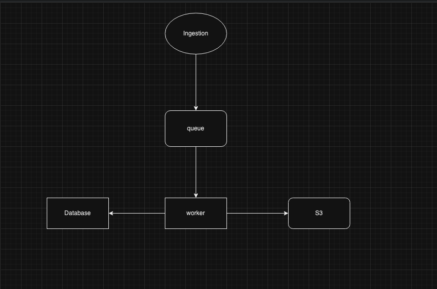

# Technical Questions

- [Coding Questions](./coding-questions.md)
- [Coding Tasks](./coding-tasks.md)
- [Aggregator-generator Question](./aggregator-generator.md)
- [Sky Scanner Question](./sky-scanner.md)
- [Rate Limiter Question](./rate-limiter.md)
- [OS_CB](./os-cb.md)
- [LRU Cache](./lru-cache.md)
- [LRU Cache Detailed](./lru-cache-2.md)
- [Ring Buffer](./ring-buffer.md)
- [Multithreading](./multithreading.md)
- [Route Validator](./route-validator.md)
- [Phone Knight](./phone-knight.md)
- [Ingestion System Design](./ingestion-system-design.md)
- [Random Pick Weighted by Country Population](./random-pick-weighted-by-country-population.md)
- [S3 File Fetcher](./s3-file-fetcher.md)
- [Valid Parenthesis](./valid-parenthesis.md)
- [Max Slice Sum](./max-slice-sum.md)
- [Find Sum](./find-sum.md)
- [Java Flattener](./java-flattener.md)
- [Ordered Iterator](./ordered-iterator.md)
- [Autocomplete - Design Exercise](./autocomplete.md)
- [Paginated API and Promises](./paginated-api-and-promises)
- [User Management Coding Exercise](./user-management-coding-exercise.md)
- [Deep Copy](./deep-copy.md)
- [Flatten Array JS](flatten-array-js.md)
- [Initial Technical Assessment](./initial-technical-assesment.md)

# Linux Trivia 

- in /etc what are the following files or dirs for:
  - crontab
  - fstab
  - group
  - hosts
  - hosts.allow
  - modprobe.d
  - passwd
  - shadow
  - security/limits.conf
  - resolv.conf
- what are run-levels?
- What are unix signals?
- What is the difference between SIGTERM and SIGKILL?

# Linux Hard Questions

- Can you catch a SIGKILL?
  answer: no.

- I've added my public ssh key into authorized_keys but I'm still getting a password prompt, what can be wrong?
  answer:

  - bad permissions on authorized_keys file, ~/.ssh directory, or homedir. group and other must not have r, w, or x.
  - private key must be unlocked.

- When trying to umount a directory it says it's busy, how to find out which
  PID holds the directory?

  - fuser
  - lsof
  - ~/proc/\*/fd~

- Explain how could you ssh login into a Linux system that DROPs all new
  incoming packets using a SSH tunnel.
  answer: local login to server, ssh out to server that can be accessed
  remotely and create a reverse tunnel. leave that ssh session running. then from workstation ssh to the
  remotely accessible server, and then ssh through the reverse tunnel to the
  final server.

#### Fun questions

- What will happen on 19 January 2038?
- You have deleted by error a running script, what could you do to restore
  it?
  - cd /proc/$pid; cat fd/255

#### Chmod question

If the chmod binary lost the execute permission, how would you fix it?

_Solution_

- Boot into sysrescdisk distro in order to get access to a version of chmod
  that has proper permissions.
- `copy /bin/cp to /bin/rescue-chmod, cat /bin/chmod > /bin/rescue-chmod, /bin/rescue-chmod +x /bin/chmod`
- use `install` binary

_Does Not Work_

- `bash /bin/chmod +x /bin/chmod` does not work. Error: cannot execute binary
  file
- chattr

---

# Cloud Interview Questions

- What is Dependency Injection, what is it good for ?
  
- Request processing - what will happen when you submit form with the data. Describe the flow of the request.
  - Easily shows how deep the candidate will go during the description
    
- Why would you use docker / kubernetes what is the main benefits ?
  
- How would you define DEVOPS ? What it means to you ? What is Helm, pulumi, terraform ?
  
- Describe some interesting project from the past.
  - Mention your concrete responsibilities, share decisions that needs to be made and why? What was you added value as team member?
  - Goal:
    - Was high level design described.
    - Was it supported by image, or how overaly was understandable.
    - Follow up open questions:
      - Did you document key decision during development, are there any?
      - What was the most complicated bug or challenge you need to tackle?
      - How did you verify/monitor performance of your solution. If you do not, how would you fix this?

- Design and Architecture - ideally should be asked during the past project.
  - Should be mainly part of the first one.
  - What is the high-level development process that you are comfortable with?

- Technology areas where the candidate feels expert.
  - Spring:
    - Do you know how Spring transaction management works?
    - Do you know how AOP works?
  - Can you pick some random library and describe how it is used?

- Development Best Practices
  - Can you describe how did you deliver new feature from requirement definition to the production working code. What were the steps where you was involved. Do you see any gaps that you have and you would consider helpful?
  - What do you consider as the ideal code coverage in %?
  - Did you use tools for measuring code quality? What values did they bring?
  - What kind of tests are being covered by the Engineering Teams?

- Operations (CI/CD, deployment, logging, metrics, observability, SLOs, app vs system level metrics, etc.):
  - What are the attributes of the app that you consider as GA ready?
  - How did you deliver new features to the existing production environment? What steps were necessary?
  - How do you understand the term engineering excellence in our industry?

- Cloud Native App Development Experience
  - Can you describe what does cloud-native application means from your perspective?
  - What are the specific steps you would do to develop new application from scratch and what would be the related decisions criteria?

- Databases and data modeling (relational vs NoSQL, schema vs no schema there is always schema, implicit vs explicit schema, etc.)
  - What kind of databases are you familiar with?
  - Can you name some specific DDL commands on the normal relational databases?
  - What are the joins good for and name some example?

- Distributed systems (more of a deep dive for backends engineers - CAP theorem, trade off between consistency and availability, distributed consensus, etc.)

---

# Kubernetes Questions

- **As a softball opener to gauge their general level of comfort with Kubernetes. Any any step in this question it is fine to take a tangent and dig into any step.**
   **What happens after you type** `kubectl apply -f app.yaml.` Assume the yaml has just a `Deployment` and `Service`

   Describe the process

   - admissions controller
     - mutating
     - validating
   - scheduling
     - filtering: what nodes can the pods be scheduled onto
     - scoring: ranks the nodes to find most suitable
     - how do the following effect the above processes?
       - NodeRestriction
       - nodeSelector
       - Affinity / Anti-affinity, node and pod
         - requiredDuringSchedulingIgnoredDuringExecution: must meet criteria
         - preferredDuringSchedulingIgnoredDuringExecution: best effort

- **What factors would you consider when deciding on self hosting your control plane vs a hosted solution?**

   Don’t care about which these choose, looking for a reasonable and objective comparison. Looking to avoid ironclad preferences for one or the other. If they choose one strong, push back and introduce new criteria and see how they reevaluate.

- **You are asked to troubleshoot an issue where pods fail with crashloopbackoff, what are the things you would check for?**

   - Check for resources assigned to the pod. (Check if OOM)
   - Liveness Probe Failed
   - Check for Pod logs
   - External dependent resources (calling an endpoint) that is down due to maintenance (For example atlantis had crashloop because of the dv-gateway maintenance)

- **As a SRE you are given a scenario where you need to deploy an agent that collects logs/metrics from the k8s cluster, what would be your approach to get the metrics/logs?**

(Could ask how we run DS only on some nodes. AKA, topolvm on ER nodes.)

- Deploy a DaemonSet to get the logs/metrics from the nodes.

**Follow up questions, I have some nodes where these DaemonSets are not running. What do you think is preventing these DaemonSets from running on these nodes?**

- Talk about taints and tolerations and how this works. ( applies to senior and staff)

Staff Level expands on how they troubleshooted an issue wrt deploying a daemonsets.

- **Compliance team reached out to the SRE team and asked to deploy images from know ECR/GAR image registries. How do you prevent your workloads from pulling images from external registries?**

   - Talk about admission Controller (how it works validating webhooks/Mutating Webhooks)
   - Open Source Tools (Kyverno which we are using in fed) / OPA to achieve this

- **What are the challenges of working in the large (3000 + nodes) kubernetes cluster?**
   Topics should cover the following:

   - Talk about how the workloads are segregated based on functionality for example (apps,gloo,ER,EW’s so on).
   - Plan for Stateful workloads ( especially the VolumeMounts) creating a nodepool in a single AZ.
   - Network exhaustion
   - Scaling
   - CI/CD (argo, flux design) talk about app of apps
   - Observability (Logging, Metrics and if possible tracing)
   - Maintenance planning
   - Cost Reduction

- **You are asked to reduced the cost of k8s cluster without impacting, or minimal impact to the performance, what are different ways you can achieve this?**

Node Consolidation (karpenter can be used here) -> [Disruption (Consolidation) | EKS Workshop](https://www.eksworkshop.com/docs/autoscaling/compute/karpenter/consolidation/)

CPU Pinning can be used without impacting the performance of the application.

- **CPU Manager** : [Control CPU Management Policies on the Node](https://kubernetes.io/docs/tasks/administer-cluster/cpu-management-policies/)
  By default, kubelet uses CFS (completely Fair Scheduler) quota to implement CPU limits. When a node runs many CPU-bound pods, the workload can move to a different CPU Core depending on whether the workload is getting throttled and which CPU cores are available during the scheduling time. Many workloads are not sensitive to this migration and work fine without intervention.

  However, workloads with CPU cache affinity and scheduling latency significantly affect the workload performance, kubelet allows CPU management policies to determine the placement preference on the nodes.

- **Configuration**:

  The kubelet has the `--cpu-manager-policy` flag that can be enabled. There are two CPU manager policies.

- **None**: the default config

- **Static**: Allows certain pods with certain characteristics to have CPU affinity and node exclusivity.

  The static policy allows containers in guaranteed pods with integer CPU requests access to exclusive CPUs on the nodes.The exclusivity is enforced by CPUSETS cgroup controller.

- **Keywords**:
  - Node has many workloads that are CPU-bound.
  - Workload getting throttled can moved to different CPU Cores or which CPU core is available during scheduling.
  - Workloads where CPU cache affinity and scheduling latency affect workload performance.- CPU manager policy comes into the picture.

[Reduce the cross-az traffic](https://aws.amazon.com/blogs/containers/optimize-az-traffic-costs-using-amazon-eks-karpenter-and-istio/)

- **What are the key components of Kubernetes architecture and what role does each component play?**
   This question assesses the candidate's understanding of the core components that make up a Kubernetes cluster and their respective functionalities. They should be able to discuss components such as the Master Node (API server, scheduler, controller manager), Worker Node (kubelet, kube-proxy), etcd, and how they collaborate to manage containerized applications efficiently.

- **Can you explain the concept of Pods in Kubernetes?**
   This question evaluates the candidate's knowledge about fundamental Kubernetes concepts. They should be able to explain that a Pod is the smallest deployable unit in Kubernetes and represents a single instance of a running process in a cluster. Pods encapsulate one or more containers, shared storage, and network resources, and they provide an environment in which containers run together.

- **How do you think Kubernetes is related to Docker?**
   Docker is used to create and run containerized applications, while Kubernetes orchestrates and manages these containers across a cluster of nodes, providing features to ensure their scalability, reliability, and availability. Therefore, Docker and Kubernetes are often used together, with Docker providing the container runtime and Kubernetes providing the orchestration and management layer.

- **What are the different types of services in Kubernetes ?**

   **ClusterIP**: This type of service exposes the Service on a cluster-internal IP address. It's typically used for internal communication between different parts of the application within the cluster. For example, if you have a frontend service that needs to communicate with a backend service, you would use a ClusterIP service.

   **NodePort**: NodePort services expose the Service on each Node's IP at a static port. This allows external access to the Service by accessing <NodeIP>:<NodePort>. It's commonly used when you need to access the Service from outside the cluster, but it's not recommended for production environments due to security and scalability reasons.

   **LoadBalancer**: LoadBalancer services provision an external load balancer in the cloud provider's infrastructure and assign it a stable external IP address. This type of service is ideal for production environments where you need to expose your Service to the internet and distribute incoming traffic across multiple backend Pods.

   **ExternalName**: ExternalName services map the Service to an external DNS name. This allows accessing external services by DNS name without exposing IP addresses or ports to the cluster. ExternalName services are useful when you need to integrate with external services or resources without modifying your application.

- [Reference : Top 50 Kubernetes Interview Questions and Answers](https://www.janbasktraining.com/blog/kubernetes-interview-questions/)

## Kubernetes - System Design 

In this scenario, the system operates with an account responsible for ingesting data from various sources. Once the data is received, it is directed to a queue service where it awaits processing by a designated worker. This worker diligently undertakes various tasks, such as parsing and aggregating the incoming logs, persisting all within the confines of its allocated memory space. Once the data processing is complete, the worker diligently dispatches the processed data to an Amazon S3 storage bucket at scheduled intervals. Additionally, the worker interacts with a database which is a key value store, from which it retrieves unique identifiers for each timeframe of processed data before freezing it to the S3 storage. This synchronized interaction between data ingestion, processing, storage, and database interaction ensures the efficient and accurate handling of the system's data flow.

As a SRE you are asked to design the worker to run on kubernetes.

- **What would be your approach to design the worker to run on kubernetes and elaborate the considerations for this design**

   Topics to be Covered:

   - Kubernetes dedicated nodepool or karpenter provsioner with specific taints and tolerations to schedule the workloads.

   - Containers(docker images) , k8s statefulsets for workloads, Persistent Volumes, Configuration (configmaps), Secrets .

- **How would you scale the workers based on the queue as we have larger ingestion?**

   - Monitor the size of the ingestion queue, eg: queue depth

   - Use of KEDA or any other opens-source tool

- **Workers need to talk to the s3 buckets securely, how can this be achieved?**

   - Utilize AWS IAM roles and service accounts to grant necessary permissions for accessing S3 buckets securely.

   - Encrypt data in transit using HTTPS and enforce TLS communication between workers and S3.

- **What are the considerations that would take into account to lower the costs?**

   - Optimize pod scheduling to ensure efficient resource utilization across nodes.(Bin Packing and Node Consolidation)

   - Implement resource quotas and limits to prevent resource over-provisioning.

   - Utilize spot instances with node-termination handler.

- **What kind of database would you choose for the fast retrieval of the data (key value) ?**

   - Consider using a distributed key-value store like Redis for fast data retrieval.

   - Evaluate the performance requirements, scalability, and consistency guarantees of the database.

   - Choose a database that supports features like data partitioning, replication, and caching for optimal performance.

   - Ensure high availability and fault tolerance by deploying the database in a clustered or replicated configuration.
