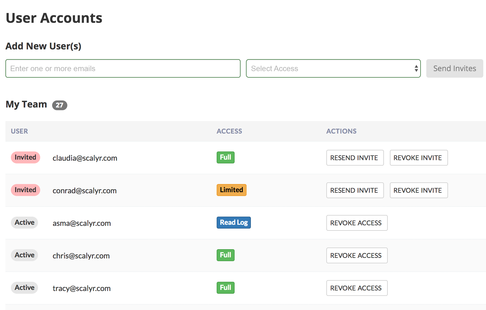

# Coding Exercise : User Management

For this challenge you will create a simple user management page in React. The page allows administrators to create users, modify user access, and delete users.

You should use the same practices implementing this challenge as you would for any professional code you write. You will be provided with access to GitHub repository of a basic project created with Create React App and including a mock backend, which you should fork to develop your project.

Please come prepared with a development laptop for completing this task. If you would prefer to have us provide a laptop, please let us know ahead of time. You will have access to the internet while on site.

## Table of Contents

1. [Set Up](#setup)
2. [Exercise](#exercise)
   a. [The Data Model](#datamodel)
   b. [The Backend](#backend)

## Set Up 

When the candidate has arrive, go the [user-management-exercise] - {create repo}, click on the **Settings** tag, and then select **Manage Access**. Ask the candidate for their GitHub username and click the green **Invite teams or people** button. Enter their username and grant **Read** access.

They may need to set up two-factor authentication. Once they're logged in to GitHub, they should be able to clone the repo and get started. They might also need to install `yarn`. When the interview process is over you should remove their access.

## Exercise 

The following sections outline the different components of the web application:

### The Data Model 

Each user account has an email address and access level associated with it. A user account is created when an administrator invites the user to join the service. The account has a state that indicates whether the user has accepted the invite.

To summarize, a user account will have the following information:

- Email address
- Access level: "full", "limited", or "read-only"
- State: "active" or "invited"

### The Backend 

The provided backend will be responsible for storing user account information. It exposes the following methods:

- Retrieve a list of users
- Invite users
- Revoke a user's access
- Resend a user's invite

When a user is added, their state is "invited"

### The User Interface 

The user management page lists all known users and provides ways to manipulate them. The user list should display the following properties for each user:

- State ("active" or "invited")
- Email Address
- Access level
- Action buttons ("Resent Invite" and "Revoke Invite", or just "Revoke Access")

The user management page allows the administrator to invite new users. To invite new users, the administrator will need to provide the following:

- One or more email addresses
- Access level (applied to all user accounts being created)

The user management page allows the administrator to perform the following operations on the existing users depending on their current state:

- Revoke
  - Revoke access completely by removing the user
  - Enabled for all users
- Resent Invite
  - Resend the invitation
  - Enabled for users in the "invited" state

Below is a picture of a sample solution. It is meant to be used as an illustration. You are free to modify it as you deem fit.

