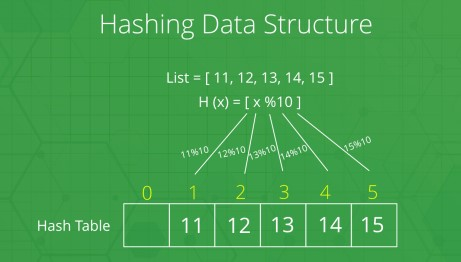

# Application of Data Structures

## Application of Arrays

- Arrays are the simplest data structures that stores items of the same data type.
- A basic application of Arrays can be storing data in tabular format.
- For example,
  if we wish to store the contacts on our phone, then the software will simply place all our
  contacts in an array.

Other applications of the arrays are:

- Arrangement of leader-board of a game can be done simply through arrays to store the score and arrange them in descending order to clearly make out the rank of each player in the game.
- A simple question Paper is an array of numbered questions with each of them assigned to some marks.
- 2D arrays, commonly known as, matrix, are used in image processing.
- It is also used in speech processing, in which each speech signal is an array.

## Application of Linked Lists

A linked list is a sequence data structure, which connects elements, called nodes, through links.

- Images are linked with each other. So, an image viewer software uses a linked list to view the previous and the next images using the previous and next buttons.
- Web pages can be accessed using the previous and the next URL links which are linked using linked list.
- The music players also use the same technique to switch between music.
- To keep the track of turns in a multi player game, a circular linked list is used

## Application of Stack

A stack is a data structure which uses LIFO order.

- Converting infix to postfix expressions.
- Undo operation is also carried out through stacks.
- Syntaxes in languages are parsed using stacks.
- It is used in many virtual machines like JVM.
- Forward – backward surfing in browser
- History of visited websites
- Message logs and all messages you get are arranged in stack
- Call logs, E-mails, Google photos’ any gallery , YouTube downloads, Notifications ( latest appears first )
- Scratch card’s earned after Google pay transaction

## Application of Queue

A queue is a data structure that uses FIFO order

- Operating System uses queue for job scheduling.
- To handle congestion in networking queue can be used.
- Data packets in communication are arranged in queue format
- Sending an E-mail, it will be queued server while responding request
- Uploading and downloading photo’s, first kept for uploading/downloading will completed first
  (Not if there is threading)
- Most of internet requests and processes uses queue
- While switching multiple applications, windows uses circular queue

## Application of Graph

Graph is a data structure where data is stored in a collection of interconnected vertices (nodes) and edges (paths)

- Facebook’s Graph API uses the structure of Graphs.
- Google’s Knowledge Graph also has to do something with Graph.
- Dijkstra algorithm or the shortest path first algorithm also uses graph structure to finding the smallest path between the nodes of the graph.
- GPS navigation system also uses shortest path APIs.
- Networking components has huge application of graph
- Facebook, Instagram and all social media networking sites every user is Node
- Data organization

## Application of Tree

Trees are hierarchical structures having a single root node.

- XML Parser uses tree algorithms.
- Decision-based algorithm is used in machine learning which works upon the algorithm of tree.
- Databases also uses tree data structures for indexing.
- Domain Name Server(DNS) also uses tree structures.
- File explorer/my computer of mobile/any computer
- BST used in computer Graphics
- Posting questions on websites like Quora, the comments are child of questions

## Application of Hash Tables

Hash Tables are store data in key-value pairs. It only stores data which has a key associated with it.
Inserting and Searching operations are easily manageable while using Hash Tables.

- Data stored in databases is generally of the key-value format which is done through hash
  tables.
- Every time we type something to be searched in google chrome or other browsers, it generates the desired output based on the principle of hashing.
- Message Digest, a function of cryptography also uses hashing for creating output in such a manner that reaching to the original input from that generated output is almost next to impossible.
- In our computers we have various files stored in it, each file has two very crucial information that is, filename and file path, in order to make a connection between the filename to its corresponding file path hash tables are used.

## Application of Heap

A Heap is a special case of a binary tree where the parent nodes are compared to their children with their values and are arranged accordingly

- In heapsort Algorithm, which is an algorithm for sorting elements in either min heap(the key of the parent is less than or equal to those of its children) or max heap(the key of the parent is greater than or equal to those of its children), sorting is done with the creation of heaps.
- Heaps are used to implement a priority queue where priority is based on the order of heap created.
- Systems concerned with security and embedded system such as Linux Kernel uses Heap Sort because of the O( n log(n) ).
- If we are stuck in finding the Kth smallest (or largest) value of a number then heaps can solve the problem in an easy and fast manner

## Application of Matrix

Matrix is an ordered collection of columns and rows of elements. It is necessary to enclose the elements of a matrix within the brackets.

- In geology, matrices are used for making seismic surveys.
- Used for plotting graphs, statistics and also to do scientific studies and research in almost different fields.
- Matrices are also used in representing the real-world data’s like the population of people, infant mortality rate, etc.
- They are best representation methods for plotting surveys.

In each of the following examples, we need to choose the best data structure(s). Options are: Array, Linked Lists, Stack, Queues, Trees, Graphs, Sets, Hash Tables.

# Questions

#### You have to store social network “feeds”. You do not know the size, and things may need to be dynamically added.

Answer

Hash table (uniquely identifies each feed while allowing additional feeds to be added (assuming dynamic resizing))

---

#### You need to store undo/redo operations in a word processor

Answer

Linked List (doubly-linked: from one node, you can go backwards/forwards one by one)

---

#### You need to evaluate an expression (i.e., parse)

Answer

Tree (integral to compilers/automata theory; rules determine when to branch and how many branches to have. look up parse trees)

---

#### You need to store the friendship information on a social networking site. I.e., who is friends with who

Answer

Graph (each person is a point, and connections/friendships are an edge)

---

#### You need to store an image (1000 by 1000 pixels) as a bitmap.

Answer

Array (2-dimensional, 1000x1000, storing color values)

---

#### To implement printer spooler so that jobs can be printed in the order of their arrival

Answer

Queue (like a queue/line of people waiting to get through a checkpoint)

---

#### To implement back functionality in the internet browser.

Answer

Stack (you can add to the stack with each site visited, and pop off as necessary to go back, as long as you don't care about going forward. If you care about forward, this is the same scenario as the word processor, so linked list)

---

#### To store the possible moves in a chess game

Answer

Tree (can follow any game move by move, down from the root to the leaf. Note that this tree is HUGE)

---

#### To store a set of fixed key words which are referenced very frequently

Answer

Hash table (If you want to use the keywords as keys, and get all things related to them, I would suggest a hash table with linked lists as the keys' corresponding values. I might be
misunderstanding this scenario, the description confuses me a little as to how they are intended to be used)

---

#### To store the customer order information in a drive-in burger place. (Customers keep on coming and they have to get their correct food at the payment/food collection window.)

Answer

Queue or Hash Table (if this is a drive thru, assuming people aren't cutting in front of one another, it's like the printer question. If customers are placing orders ahead of time, and can arrive in any order, a hash table would be much better, with an order number or customer name as the key and the order details as the value)

---

#### To store the genealogy information of biological species.

Answer

Tree (look up phylogenic tree)

---
