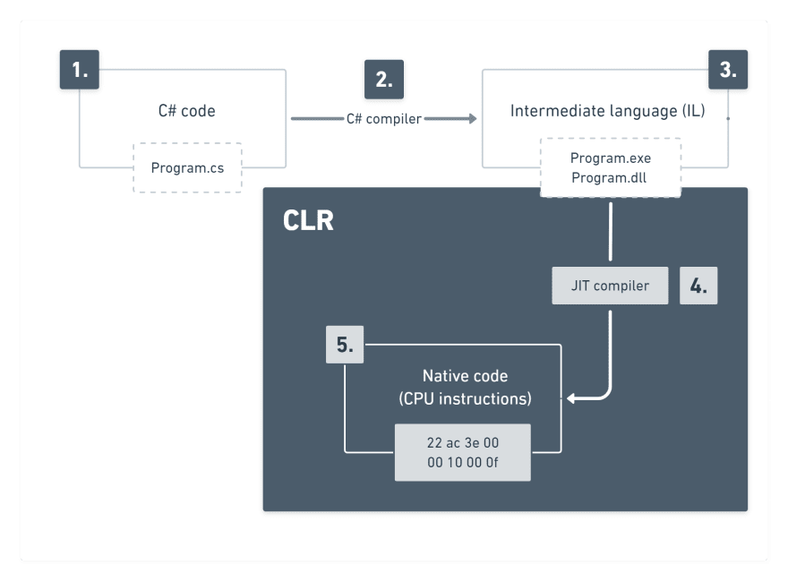

# C# and .NET

## General Questions

####

<details>
<summary>Answer</summary>
<p>

</p>
</details>

---

## Questions are in Interviews

#### Explain .NET compilation process

<details>
<summary>Answer</summary>
<p>
[Reference Link](https://dev.to/kcrnac/net-execution-process-explained-c-1b7a)

- A developer writes C# code
- C# compiler checks the syntax and analyzes the source code
- Microsoft intermediate languages (MSIL) is generated as a result (EXE or DLL)
- CLR gets initialized inside of a process and runs entry point method (Main)
- MSIL gets converted to native code by the JIT compiler



</p>
</details>

---

#### What is Dependency Injection

<details>
<summary>Answer</summary>
<p>
Dependency injection is a programming technique that makes a class independent of its dependencies. It achieves that by decoupling the usage of an object from its creation. This helps you to follow SOLID's dependency inversion and single responsibility principles.

There are three types of dependency injection — constructor injection, method injection, and property injection

</p>
</details>

---

#### Difference between AddScoped, Transient, and Singelton

<details>
<summary>Answer</summary>
<p>

[Reference Link](https://www.c-sharpcorner.com/article/understanding-addtransient-vs-addscoped-vs-addsingleton-in-asp-net-core/)

The lifetime of the service depends on when the dependency is instantiated and how long it lives. And lifetime depends on how we have registered those services.

The below three methods define the lifetime of the services,

1. **AddTransient**
   Transient lifetime services are created each time they are requested. This lifetime works best for lightweight, stateless services.

2. **AddScoped**
   Scoped lifetime services are created once per request.

3. **AddSingleton**
   Singleton lifetime services are created the first time they are requested (or when ConfigureServices is run if you specify an instance there) and then every subsequent request will use the same instance.

</p>
</details>

---

#### async await in c#

<details>
<summary>Answer</summary>
<p>
[Reference Link](https://www.c-sharpcorner.com/article/async-and-await-in-c-sharp/)

The "async" keyword marks a method asynchronous, meaning it can be run in the background while another code executes. When you mark a method as async, you can use the "await" keyword to indicate that the method should wait for the result of an asynchronous operation before continuing.

```csharp
class Program
{
    static void Main(string[] args)
    {
        Method1();
        Method2();
        Console.ReadKey();
    }

    public static async Task Method1()
    {
        await Task.Run(() =>
        {
            for (int i = 0; i < 100; i++)
            {
                Console.WriteLine(" Method 1");
                // Do something
                Task.Delay(100).Wait();
            }
        });
    }


    public static void Method2()
    {
        for (int i = 0; i < 25; i++)
        {
            Console.WriteLine(" Method 2");
            // Do something
           Task.Delay(100).Wait();
        }
    }
}

```

</p>
</details>

---

#### Which is faster in JavaScript and ASP script?

<details>
<summary>Answer</summary>
<p>

JavaScript is faster compared to ASP Script because JavaScript is a client-side scripting language and does not depend on the server to execute it but the ASP script is a server-side scripting language always dependable on the server.

</p>
</details>

---

####

<details>
<summary>Answer</summary>
<p>

</p>
</details>

---

####

<details>
<summary>Answer</summary>
<p>

</p>
</details>

---

####

<details>
<summary>Answer</summary>
<p>

</p>
</details>

---

####

<details>
<summary>Answer</summary>
<p>

</p>
</details>

---

####

<details>
<summary>Answer</summary>
<p>

</p>
</details>

---

####

<details>
<summary>Answer</summary>
<p>

</p>
</details>

---

What technologies do you have work?
Tell me about yourself?
How do you implement OOPS concepts Abstraction, Polymorphism, and Inheritance?
Types of polymorphism?
How do you override a method?
SOLID principle?
Does Diff bet abstract vs interfaces?
ref and out?
String and StringBuilder?
Private constructor in abstract method and normal class?
Encapsulate data in c#?
Struct and class?
What is a Static constructor?
What is Operator overriding and overriding?
Why is it possible to write a constructor for an abstract class in C#?
As far as I know, we can’t instantiate an abstract class.. so what is it for?
Explain ASP.NET MVC life cycle?
What is Postbank in ASP.NET?
What are tag helpers?
taghelper vs HTML helper ?
What are filters?
temp data viewing viewdata?
What are HTML helpers?
attribute-based routing?
razor and ASPX view engine?
What is MVCscaffolding?
What is route constraint?
binding and magnification?
What is the entity framework?
rest API diff methods?
put vs post?
HTTP status code categories?
messaging in terms of restful services?
protocol supported by rest API?
What is a TCP 3-way handshake?
ASP.NET Web API application life cycle?
media type formatter ?
web API filters?
What is HTTPResponse msg?
API controller and controller?
What is Hoisting in js?
Difference between equal to and double = to?
What is coercion js?
What is currying js?
What is Higher order func js?
Different CSS selectors?
1 div with id, contains 4 div in it and each of those 4 div consist more 4 div again. now select only even number div from 2nd div and odd number from 3rd div
What are Indexing SQL server and their types?
What are triggers and their types?
Write a query to find the top 10 amps from each designation?
Project management questions like,
How do you estimate the project in agile?
Few last days of development remain and if one developer is ill then how do you handle the situation?
Have you worked on cloud services?
What is an Elastic job?
What are Azure Functions?
What is Container?
Diff between TFS or DevOps?
What is the Burndown chart in Azure DevOps?
What is Collection?
What is Generic Collection?
What is Linked List?
What is Stack?
What is Queue?
What is Polymorphism?
What is Method Overloading?
Diff between Constant and ReadOnly?
Diff between the ref and out?
What is the static method?
What are delegates?
What is enum?
Any automation done that has reduced the work and directly impact to customer?
Are you using SQL or any other technology to manipulate data in code itself i.e. EF?
Diff between union vs union all?
What is a trigger?
What is a transaction?
What are indexes?
Impersonation in asp net?
What is Action result in Web API?
Diff between put and post?
Diff between ViewBag and ViewData?
Diff between Authorization and Authentication?
How to implement Authorization?
What is partial class?
