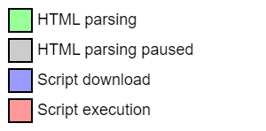
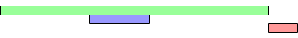

# JavaScript


#### What are the distinctions among the keywords `var`, `let` and `const` ?

<details>
<summary>Answer</summary>
<p>
</p>
</details>

---

#### Difference between let and var keywords

<details>
<summary>Answer</summary>
<p>

1. var is global scoped and let is block scoped
2. var declaration is hoisted and is initialized with undefined value, but let is not initialized undefined value
3. var variables can be redeclared in its own scope and let variables cannot be redeclared in its scope

</p>
</details>

---


#### What is `optional chaining` ? and what problem does it solve ?

<details>
<summary>Answer</summary>
<p>
</p>
</details>

---

#### What is `spread` operator and when do we use it ?

<details>
<summary>Answer</summary>
<p>
</p>
</details>

---

#### What is `template literal`?
   ```js
   `blah ${variable}`
   ```

<details>
<summary>Answer</summary>
<p>
</p>
</details>

---

#### What is `null coalescence` operator ?
   ```js
   ??
   ```

<details>
<summary>Answer</summary>
<p>
</p>
</details>

---

#### Is the code given below valid? If yes, what property of JS does it use?

   ```js
   x = 5; // Assign 5 to x
   elem = document.getElementById("demo"); // Find an element
   elem.innerHTML = x; // Display x in the element

   var x; // Declare x
   ```

   <details>
   <summary>Answer</summary>
   <p>
   It is valid and it uses hoisting.
   This snippet won't work for let. (Temporal Dead Zone)
   </p>
   </details>

#### Is this function correct or incorrect
`js
    const arr = [1,2,3]
    arr.forEach(function(val) {
        if(val%2 === 0) {
            break;
        }
    console.log(val);
    })
    `
<details>
<summary>Answer</summary>
<p>
This function is incorrect because `break` is valid inside a loop.
But in the above code snippet, it is used inside a function and `break` is not valide inside a function.

Correct way to write it will be :

```js
const arr = [1, 2, 3];
for (let i = 0; i < arr.length; i++) {
  if (arr[i] % 2 === 0) {
    break;
  }
  console.log(val);
}
```

OR

```js
const arr = [1, 2, 3];
let done = false;
arr.forEach(function (val) {
  if (val % 2 === 0) {
    done = true;
  }
  if (!done) {
    console.log(val);
  }
});
```

</p>
</details>

---


#### Difference between `async` and `defer`

<details>
<summary>Answer</summary>
<p>



`<script>`


Let’s start by defining what **`<script>`** without any attributes does. The HTML file will be parsed until the script file is hit, at that point parsing will stop and a request will be made to fetch the file (if it’s external). The script will then be executed before parsing is resumed.

`<script async>`


**async** downloads the file during HTML parsing and will pause the HTML parser to execute it when it has finished downloading.

`<script defer>`



**defer** downloads the file during HTML parsing and will only execute it after the parser has completed. **defer** scripts are also guaranteed to execute in the order that they appear in the document.

**When should I use what?**
Typically, you want to use async where possible, then defer, then no attribute.
async > defer > no attribute

- If the script is modular and does not rely on any scripts then use async
- If the script relies upon or is relied upon by another script then use defer
- If the script is small and is relied upon by an async script then use an inline script with no attributes placed above the async scripts

</p>
</details>

---


#### How to delete property-specific values?

<details>
<summary>Answer</summary>
<p>
 The delete keyword is used to delete the whole property and all the values at once like
```js
let gfg={Course: "DSA", Duration:30};
delete gfg.Course;
```
</p>
</details>

---

#### What is the output for each of the following?

```javascript

> -1/0
> 1/0
> -Infinity - Infinity
> -Infinity + Infinity
> Infinity - 1
```

<details>
<summary>Answer</summary>
<p>

```js
> -1/0  // -Infinity
> 1/0   // Infinity
> -Infinity - Infinity  // -Infinity
> -Infinity + Infinity  // NaN
> Infinity - 1  // Infinity
```

</p>
</details>

---

#### What is negative infinity?

<details>
<summary>Answer</summary>
<p>
The negative infinity in JavaScript is a constant value that is used to represent the lowest available value. It means that no other number is lesser than this value. It can be generated using a self-made function or by an arithmetic operation. JavaScript shows the NEGATIVE_INFINITY value as -Infinity.

</p>
</details>

---

#### What is the ‘Strict’ mode in JavaScript and how can it be enabled?

<details>
<summary>Answer</summary>
<p>
Strict mode is a way to introduce better error-checking into your code.

When you use strict mode, you cannot use implicitly declared variables, or assign a value to a read-only property, or add a property to an object that is not extensible.
You can enable strict mode by adding “use strict” at the beginning of a file, a program, or a function.

</p>
</details>

---

#### Explain call, apply and bind

<details>
<summary>Answer</summary>
<p>

call, apply, and bind are methods available on JavaScript functions that allow you to control the value of this within the function and pass arguments in different ways. They are commonly used for function invocation and for borrowing methods from other objects. Here's an explanation of each:

**call:**

- The call method is used to invoke a function and explicitly specify the value of this.
- It also allows you to pass arguments individually (comma-separated) to the function.
- Syntax: function.call(thisValue, arg1, arg2, ...)

**apply:**

- The apply method is similar to call, but it allows you to pass arguments as an array.
- It is often used when the number of arguments is not known in advance or when you want to apply an array of arguments to a function.
- Syntax: function.apply(thisValue, [arg1, arg2, ...])

**bind:**

- The bind method returns a new function with a fixed value of this, which you can invoke later.
- It is useful when you want to create a new function with a specific context (this) that you can use multiple times.
- Syntax: function.bind(thisValue, arg1, arg2, ...)

```javascript
function greet(message, punctuate) {
  console.log(`${message}, ${this.name}${punctuate}`);
}

const person1 = { name: "Alice" };
const person2 = { name: "Bob" };

// Using call
greet.call(person1, "Hello", "!"); // Output: Hello, Alice!
greet.call(person2, "Hi", "."); // Output: Hi, Bob.

// Using apply
greet.apply(person1, ["Hey", "..."]); // Output: Hey, Alice...
greet.apply(person2, ["Hola", "?"]); // Output: Hola, Bob?

// Using bind
const greetPerson1 = greet.bind(person1, "Hi");
const greetPerson2 = greet.bind(person2, "Hey");
greetPerson1("!"); // Output: Hi, Alice!
greetPerson2("?"); // Output: Hey, Bob?
```

</p>
</details>

---

#### How would you create a private variable in JavaScript?

<details>
<summary>Answer</summary>
<p>
avaScript does not have built-in support for private variables in the same way that some other programming languages do. However, you can achieve a level of data encapsulation and privacy using various techniques. One common approach is to use closures to create private variables within a function scope. Here's how you can do it:

```js
function createCounter() {
  let count = 0; // This is a private variable

  return {
    increment: function () {
      count++;
    },
    decrement: function () {
      count--;
    },
    getCount: function () {
      return count;
    },
  };
}

const counter = createCounter();
console.log(counter.getCount()); // Output: 0

counter.increment();
counter.increment();
console.log(counter.getCount()); // Output: 2

counter.decrement();
console.log(counter.getCount()); // Output: 1

console.log(counter.count); // Output: undefined (count is private)
```

In this example, the createCounter function returns an object with three methods: increment, decrement, and getCount. The count variable is declared using let within the scope of the createCounter function, making it private and inaccessible from outside the function. The returned object's methods have access to the count variable due to JavaScript's closure mechanism, allowing them to modify and access the private variable.

This approach provides a way to encapsulate data and create private variables within a specific scope. Keep in mind that it's not true encapsulation or true privacy, as determined developers could still access the private variable through various means. However, it's a common and widely used technique in JavaScript to achieve a level of data protection and organization

</p>
</details>

---

#### What is Closure in JavaScript? Provide an example

<details>
<summary>Answer</summary>
<p>
A closure is a fundamental concept in JavaScript that occurs when a function is defined within another function and retains access to the variables and scope of its outer (enclosing) function, even after the outer function has finished executing. In other words, a closure "closes over" its surrounding lexical scope, preserving the state of variables at the time of its creation.

Closures are often used to create data privacy, encapsulation, and to maintain state across multiple function calls.

```js
// Closure Example - JS
function outerFunction() {
  const outerVariable = "I am from outer";

  function innerFunction() {
    console.log(outerVariable); // innerFunction has access to outerVariable
  }

  return innerFunction; // Return innerFunction, creating a closure
}

const myClosure = outerFunction(); // myClosure now holds the innerFunction
myClosure(); // Output: I am from outer
```

</p>
</details>

---

#### What are Generator Function

<details>
<summary>Answer</summary>
<p>
In JavaScript, a function name that starts with an asterisk (*) indicates a generator function. Generator functions are a special type of function that can be paused and resumed during execution, allowing you to generate a sequence of values over time.

Generator functions are defined using the function\* syntax, and they use the yield keyword to produce values one at a time. They are often used for working with asynchronous operations, lazy evaluation, and iteration.

```js
function* numberGenerator() {
  let num = 1;
  while (true) {
    yield num;
    num++;
  }
}

const generator = numberGenerator();

console.log(generator.next().value); // Output: 1
console.log(generator.next().value); // Output: 2
console.log(generator.next().value); // Output: 3
// ...
```

In this example, numberGenerator is a generator function that yields an incrementing number each time generator.next() is called. The function can be paused and resumed at each yield statement.

Generator functions are particularly useful when dealing with asynchronous operations, as they allow you to write asynchronous code that looks more like synchronous code, making it easier to manage complex asynchronous workflows.

Note that while generator functions start with an asterisk (\*), the variable names you use for generator instances (like generator in the example) don't need to start with an asterisk. The asterisk is used to define the generator function itself.

</p>
</details>

---

#### What is Event Loop

<details>
<summary>Answer</summary>
<p>
The event loop is a fundamental concept in JavaScript that plays a crucial role in managing and handling asynchronous operations and events within the JavaScript runtime environment. It is responsible for coordinating the execution of various code blocks, callbacks, and events, allowing non-blocking, efficient, and responsive handling of tasks.

Here's a high-level explanation of how the event loop works:

Call Stack: When a JavaScript program is executed, it starts by adding the main script to the call stack. As functions are called, they are added to the call stack, and their execution starts. The call stack follows a Last-In-First-Out (LIFO) order.

Asynchronous Operations: JavaScript is single-threaded, meaning it processes one task at a time. However, many operations are asynchronous, such as fetching data from a server, reading files, and handling user input.

Web APIs and Callbacks: Asynchronous operations are offloaded to Web APIs provided by the browser or runtime environment. These APIs include setTimeout, fetch, and others. When an asynchronous operation is started, it is moved out of the call stack to the Web API environment. Once the operation is complete, a callback function is pushed to the callback queue.

Callback Queue: The callback queue holds the callback functions that are ready to be executed. These callbacks are enqueued in the order they were completed.

Event Loop: The event loop constantly checks the call stack and the callback queue. If the call stack is empty, the event loop pops the next callback from the queue and pushes it onto the call stack, initiating its execution.

Execution of Callbacks: As callbacks are executed, they may initiate further asynchronous operations. These operations follow the same cycle of being offloaded to Web APIs, and their corresponding callbacks are placed in the callback queue.

The event loop ensures that the JavaScript runtime remains responsive, even when dealing with time-consuming tasks or waiting for external resources. It allows developers to write code that appears synchronous, even though it's executing asynchronously in the background.

</p>
</details>

---
#### Question

```javascript
const work = "hello";
word[1] = "m";
console.log(word);
```

<details>
<summary>Answer</summary>
<p>

`hello`
Strings are immutable.

</p>
</details>

---

#### Question

```javascript
console.log(a);

const a = 1;
```

<details>
<summary>Answer</summary>
<p>
```javascript
 Uncaught ReferenceError: a is not defined
```
</p>
</details>

---

#### Explain Currying and Hoisting in Javascript.

<details>
<summary>Answer</summary>
<div>
 <div>
  <b>Currying: </b>Technique in functional programming, that transforms the function of multiple arguments into several functions of a single argument in sequence.
 </div>

```javascript
function simpleFunction(param1, param2, param3, .....) => function curriedFunction(param1)(param2)(param3)(....
```

Why use Currying:

1. It helps us to create a higher-order function
2. It reduces the chances of error in our function by dividing it into multiple smaller functions that can handle one responsibility.
3. It is very useful in building modular and reusable code
4. It helps us to avoid passing the same variable multiple times
5. It makes the code more readable

Example:

```javascript
function calculateVolume(length) {
  return function (breadth) {
    return function (height) {
      return length * breadth * height;
    };
  };
}
console.log(calculateVolume(4)(5)(6));
```

---

**Hoisting:** is a concept that enables us to extract values of variables and functions even before initializing/assigning value without getting errors and this happens during the <u>1st phase (memory creation phase) of the Execution Context.</u>

> Note: JavaScript only hoists declarations, not initializations.

Example:

```javascript
console.log(foobar());
function foobar() {
  return "Hello";
}
function foobar() {
  return "Bellow";
}
function foobar() {
  return "Chime";
}
function foobar() {
  return "Prime";
}

// Output: Prime
```

</div>
</details>

---

#### Different between Typescript and Javascript

<details>
<summary>Answer</summary>
<table>
  <thead>
    <tr>
      <th>Feature</th>
      <th>TypeScript</th>
      <th>JavaScript</th>
    </tr>
  </thead>
  <tbody>
    <tr>
      <td>Typing</td>
      <td>Provides static typing</td>
      <td>Dynamically typed</td>
    </tr>
    <tr>
      <td>Tooling</td>
      <td>Comes with IDEs and code editors</td>
      <td>Limited built-in tooling</td>
    </tr>
    <tr>
      <td>Syntax</td>
      <td>Similar to JavaScript, with additional features</td>
      <td>Standard JavaScript syntax</td>
    </tr>
    <tr>
      <td>Compatibility</td>
      <td>Backward compatible with JavaScript</td>
      <td>Cannot run TypeScript in JavaScript files</td>
    </tr>
    <tr>
      <td>Debugging</td>
      <td>Stronger typing can help identify errors</td>
      <td>May require more debugging and testing</td>
    </tr>
    <tr>
      <td>Learning curve</td>
      <td>Can take time to learn additional features</td>
      <td>Standard JavaScript syntax is familiar</td>
    </tr>
  </tbody>
</table>
</details>

---

#### Explain promise chaining in javascript?

<details>
<summary>Answer</summary>
A simple concept by which we may initialize another promise inside our *Hello*  method and accordingly we may execute our results. The function inside then captures the value returned by the previous promise
</details>

---

#### How does javascript figures out that a promise is resolved?

<details>
<summary>Answer</summary>
<p>

</p>
</details>

---

#### Implement Function.prototype.bind polyfill

<details>
<summary>Answer</summary>
<p>

</p>
</details>

---

#### Explain Event loop, and how setTimeout and Promises are queued

<details>
<summary>Answer</summary>
<p>

</p>
</details>

---

#### Prototypal Inheritance in Javscript and how does prototype chain works?

<details>
<summary>Answer</summary>
<p>

Prototypal inheritance is a fundamental concept in JavaScript that allows objects to inherit properties and methods from other objects. In JavaScript, every object has an associated prototype object, and objects can inherit properties and methods from their prototype.

Here's an overview of how prototypal inheritance and the prototype chain work:

Prototype Object:

Every object in JavaScript has a prototype object, which is used as a template for creating new objects.
Objects inherit properties and methods from their prototype, which forms the basis of inheritance.
Constructor Functions:

Constructor functions are used to create objects that share the same prototype.
When you create an object using a constructor function, the new object's prototype is set to the prototype of the constructor function.
prototype Property:

The prototype property of a constructor function is an object that becomes the prototype of objects created using that constructor.
Properties and methods defined on the prototype are shared among all instances created from the constructor.
**proto** Property (deprecated, use with caution):

Each object has a special property called **proto** that points to its prototype object.
This property was used to manually access and modify the prototype chain, but it's now recommended to use Object.getPrototypeOf() and Object.setPrototypeOf() instead.
Prototype Chain:

The prototype chain is a chain of prototype objects that links an object to its ancestors.
When you access a property or method on an object, JavaScript looks up the prototype chain to find the property or method. If not found in the object itself, it looks in its prototype, and so on.
The prototype chain continues until the top-level object (Object.prototype) is reached, which is the base prototype for all objects.
Here's a simple example illustrating prototypal inheritance and the prototype chain:

```js
// Constructor function
function Animal(name) {
  this.name = name;
}

// Adding a method to the prototype
Animal.prototype.sayHello = function () {
  console.log(`Hello, I'm ${this.name}`);
};

// Creating instances
const cat = new Animal("Whiskers");
const dog = new Animal("Buddy");

// Calling the method
cat.sayHello(); // Output: Hello, I'm Whiskers
dog.sayHello(); // Output: Hello, I'm Buddy

// Checking the prototype chain
console.log(cat.hasOwnProperty("name")); // true
console.log(cat.hasOwnProperty("sayHello")); // false
```

In this example, the Animal constructor function has a prototype with the sayHello method. Instances of Animal (like cat and dog) inherit this method through the prototype chain. When you call cat.sayHello(), JavaScript first looks for sayHello in cat itself. Since it's not found, it continues up the prototype chain and finds it on the Animal.prototype.

</p>
</details>

---

#### What is a reduce function in Javascript. How to write a polyfill of a reduce function? He wanted me to cover all cases while writing a pollyfill of reduce. (check MDN documentation )

<details>
<summary>Answer</summary>
<p>

</p>
</details>

---

#### How does Redux Saga works, what problem it solves and how can we achieve our goals without redux saga?

<details>
<summary>Answer</summary>
<p>

</p>
</details>

---

#### Question

How will you design a calendar? What controls will you make? What events will you attach? How will you render a numbers in calendar for every month?

- write JS functions
- Write CSS layout
<details>
<summary>Answer</summary>
<p>

</p>
</details>

---

#### What is the output of the following code? Give reason for the same

```javascript
const work = "hello";
word[1] = "m";
console.log(word);
```

<details>
<summary>Answer</summary>
<p>

Output :
`hello`

Reason :
Strings are immutable.

</p>
</details>

---

#### Is the code given below valid? If yes, what property of JS does it use?

```javascript
x = 5; // Assign 5 to x

elem = document.getElementById("demo"); // Find an element
elem.innerHTML = x; // Display x in the element

var x; // Declare x
```

<details>
<summary>Answer</summary>
<p>
The given code is valid.     <br/>
<strong>Hoisting</strong> is the property of JS used.
</p>
</details>

---

#### Question

```javascript
console.log(a);

const a = 1;
```

<details>
<summary>Answer</summary>
<p>
Output:
```javascript
Uncaught ReferenceError: a is not defined
```

Reason:
Hoisting is not done for these

</p>
</details>

---

#### Explain Currying and Hoisting in Javascript.

<details>
<summary>Answer</summary>
<p>

</p>
</details>

---

#### Different between Typescript and Javascript

<details>
<summary>Answer</summary>
<p>

</p>
</details>

---

#### Question

```html
<body>
    <script src="index.js">
    <div>
    </div>
</body>

```

What will happen to DOM tree if some issue happens in script tag?

<details>
<summary>Answer</summary>
<p>

</p>
</details>

---

#### Explain promise chaining in javascript?

<details>
<summary>Answer</summary>
<p>

Promise chaining is a technique in JavaScript that allows you to chain multiple asynchronous operations together using promises. It provides a clean and sequential way to handle asynchronous tasks and their results. Each promise in the chain represents a step in the sequence of operations.

```javascript
// Simulate an asynchronous operation that returns a promise
function fetchUserData() {
  return new Promise((resolve, reject) => {
    setTimeout(() => {
      const userData = { id: 1, name: "John" };
      resolve(userData);
    }, 1000);
  });
}

function fetchUserPosts(userId) {
  return new Promise((resolve, reject) => {
    setTimeout(() => {
      const userPosts = [
        { id: 101, title: "Post 1" },
        { id: 102, title: "Post 2" },
      ];
      resolve(userPosts);
    }, 1500);
  });
}

// Chaining promises
fetchUserData()
  .then((userData) => {
    console.log("User data:", userData);
    return fetchUserPosts(userData.id);
  })
  .then((userPosts) => {
    console.log("User posts:", userPosts);
  })
  .catch((error) => {
    console.error("Error:", error);
  });
```

Explanation

- fetchUserData simulates an asynchronous operation that returns a user's data as a promise.
- fetchUserPosts simulates an asynchronous operation that returns a user's posts as a promise, taking a userId parameter.
- We chain the promises using the .then() method. The first .then() handles the user data, and the second .then() handles the user posts. The return statement in the first .then() returns the promise from fetchUserPosts, allowing it to be chained.
- The .catch() method is used to handle any errors that may occur during the promise chain.

</p>
</details>

---

#### How does javascript figures out that a promise is resolved?

<details>
<summary>Answer</summary>
<p>

</p>
</details>
---

#### What is Debounce and Throttle in js?

<details>
<summary>Answer</summary>
<p>
debounce => Input search minimise api calls => setinterval is usey

Throttle => gracefully handle heavyCBs (scroll-event) => setTimeout is usey

</p>
</details>
---


<!--
- What is EcmaScript in JavaScript?
- What is difference between let, const and var?
- What is spread operator, rest operator, default parameter?
- What is deep copy and shallow copy in JavaScript?
- What is promise, callback function, async await in JavaScript?
- What is difference between promise and callback in JavaScript?
- What is event bubbling and event capturing in JavaScript?
- What is Higher Order Function in JavaScript?
- Explain different two types of function in JavaScript
- What is arrow function in JavaScript?
- Why we use call, apply, bind method in JavaScript?
- How many ways to create object in JavaScript?
- What is prototype inheritance in JavaScript?
- What is typescript?
- What are the array method, string method?
- What is difference between java and javascript?
- What is throttling and debouncing in js?
- What is Null and undefined in js?
- What are the falsy values in js?
- What is executing context, event loop, stack, call queue, microtask queue in js?
- What is setTimeOut and setInterval in js?
- What is object.seal and object.freeze in js?
- What is difference between map and set in js?
- What is WeakMap and Weakset in JavaScript?
- What is sessionStorage, localStorage, cookie?
- Write a program to sort an array
- What is the use of json.stringify and json.parse() method in js?
- What are map, filter and reduce in js?
- What is generator function in js?
- How to stop event propagation in js?
- What is closure in js?
- What is hoisting in js?
- What is dead zone in js?
- What is function currying in js?
- What is mutation observer in js?
- What is memoization in js?
- What is Debounce and Throttle in js? -->
