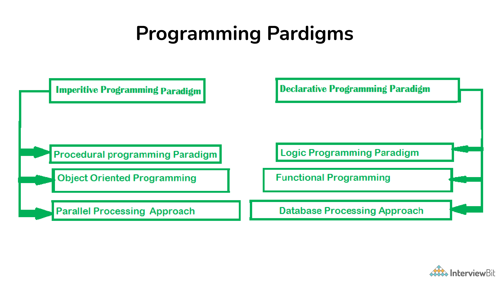

# OBJECT ORIENTED PROGRAMMING

### Programming Paradigms

<details>
<summary>Answer</summary>
<p>

Programming paradigms refers to the method of classification of programming languages based on their features. There are mainly two types of Programming Paradigms:

- Imperative Programming Paradigm
- Declarative Programming Paradigm
  Now, these paradigms can be further classified based:

- **Imperative Programming Paradigm:**
  Imperative programming focuses on HOW to execute program logic and defines control flow as statements that change a program state. This can be further classified as:

  - **Procedural Programming Paradigm:**
    Procedural programming specifies the steps a program must take to reach the desired state, usually read in order from top to bottom.
  - **Object-Oriented Programming or OOP:**
    Object-oriented programming (OOP) organizes programs as objects, that contain some data and have some behavior.
  - **Parallel Programming:**
    Parallel programming paradigm breaks a task into subtasks and focuses on executing them simultaneously at the same time.

- **Declarative Programming Paradigm:**
  Declarative programming focuses on WHAT to execute and defines program logic, but not a detailed control flow. Declarative paradigm can be further classified into:
  - **Logical Programming Paradigm:**
    Logical programming paradigm is based on formal logic, which refers to a set of sentences expressing facts and rules about how to solve a problem
  - **Functional Programming Paradigm:**
    Functional programming is a programming paradigm where programs are constructed by applying and composing functions.
  - **Database Programming Paradigm:**
    Database programming model is used to manage data and information structured as fields, records, and files.



</p>
</details>

---

### Summary of OOPs

<details>
<summary>Answer</summary>
<p>
1. Object - Instance of Class   <br>
2. Class - Blue print of Object      <br>        
3. Encapsulation - Protecting our Data   <br>           
4. Polymorphism - Different behaviors at different instances      <br>        
5. Abstraction - Hiding our irrelevant Data       <br>        
6. Inheritence - One property of object is acquiring to another property of object  <br>        
</p>
</details>

---

### OOPs advantages

<details>
<summary>Answer</summary>
<p>

- Modularity (Easy troubleshooting, Debugging)
- Flexibility (Polymorphism)
- Reusability (Inheritance)
- Security (Abstraction)
- Design Benefits (Fewer flaws, Eliminating risks, Fixing bugs)

</p>
</details>

---

### Explain Polymorphism and Types of Polymorphism

<details>
<summary>Answer</summary>
<p>

- Polymorphism is composed of two words - “poly” which means “many”, and “morph” which means “shapes”. Therefore - Polymorphism refers to something that has many shapes.
- Polymorphism refers to the process by which some code, data, method, or object behaves differently under different circumstances or contexts.

Types of Polymorphism:

1. Compile Time Polymorphism - Early Binding - Static Binding - Overloading

- Operator Overloading
- Method Overloading

2. Run Time Polymorphishm - Late Binding - Dynamic Binding - Overriding

```csharp
// Method Overloading
    void sum() { ... }
    void sum(int num1, int num2 ) { ... }
    void sum(float num1, float num2) { ... }
    void sum(int num1 , float num2, double num3 ) { ... }
```

</p>
</details>

---

### Compile Time Polymorphism

<details>
<summary>Answer</summary>
<p>

**Compile Time Polymorphism (early binding)**

Compile Time polymorphism is also called

- Early Binding
- Static Biding
- Overloading
  - Method overloading
  - Operator overloading

```csharp

// C# Example - Compile Time Polymorphism

class MathOperations {
    // Method Overloading
    public int add(int a, int b) {
        return a + b;
    }

    public double add(double a, double b) {
        return a + b;
    }

    // Operator Overloading (not directly supported in Java)
    public String concatenate(String str1, String str2) {
        return str1 + str2;
    }
}

public class Main {
    public static void main(String[] args) {
        MathOperations math = new MathOperations();

        // Method Overloading
        System.out.println("Sum of integers: " + math.add(5, 3));
        System.out.println("Sum of doubles: " + math.add(2.5, 3.7));

        // Operator Overloading
        String result = math.concatenate("Hello, ", "World!");
        System.out.println("Concatenated string: " + result);
    }
}

```

```java
// Java Example - Compile Time Polymorphism

class MathOperations {
    // Method Overloading
    public int add(int a, int b) {
        return a + b;
    }

    public double add(double a, double b) {
        return a + b;
    }

    // Operator Overloading (not directly supported in Java)
    public String concatenate(String str1, String str2) {
        return str1 + str2;
    }
}

public class Main {
    public static void main(String[] args) {
        MathOperations math = new MathOperations();

        // Method Overloading
        System.out.println("Sum of integers: " + math.add(5, 3));
        System.out.println("Sum of doubles: " + math.add(2.5, 3.7));

        // Operator Overloading
        String result = math.concatenate("Hello, ", "World!");
        System.out.println("Concatenated string: " + result);
    }
}

```

</p>
</details>

---

### Run Time Polymorphism

<details>
<summary>Answer</summary>
<p>

**Run Time Polymorphism (late binding)**

Run Time polymorphism is also called

- Late Binding
- Dynamic Biding
- Overriding
  - Method overriding

```csharp
// C# Example - Run Time Polymorphism

using System;

class Animal {
    public virtual void Sound() {
        Console.WriteLine("Animal makes a sound");
    }
}

class Dog : Animal {
    public override void Sound() {
        Console.WriteLine("Dog barks");
    }
}

class Cat : Animal {
    public override void Sound() {
        Console.WriteLine("Cat meows");
    }
}

class Program {
    static void Main(string[] args) {
        Animal animal;

        animal = new Dog();
        animal.Sound();  // Calls Dog's overridden Sound method

        animal = new Cat();
        animal.Sound();  // Calls Cat's overridden Sound method
    }
}


```

```java
// Java Example - Run Time Polymorphism

class Animal {
    void sound() {
        System.out.println("Animal makes a sound");
    }
}

class Dog extends Animal {
    @Override
    void sound() {
        System.out.println("Dog barks");
    }
}

class Cat extends Animal {
    @Override
    void sound() {
        System.out.println("Cat meows");
    }
}

public class Main {
    public static void main(String[] args) {
        Animal animal;

        animal = new Dog();
        animal.sound();  // Calls Dog's overridden sound method

        animal = new Cat();
        animal.sound();  // Calls Cat's overridden sound method
    }
}


```

</p>
</details>

---

### What is Inheritance? Explain Types of Inheritance

<details>
<summary>Answer</summary>
<p>

Types of Inheritance:

- Single Level
- Multi-Level
- Multiple
- Hybrid

</p>
</details>

---

### What is Encapsulation?

<details>
<summary>Answer</summary>
<p>

Encapsulation refers to the practice of bundling data (attributes) and methods (functions) that operate on that data into a single unit called a class.

In encapsulation:

- Data is typically marked as private or protected, restricting direct access from outside the class.
- Methods within the class provide controlled ways to access or modify the data, ensuring data consistency and maintaining the desired behavior.

Encapsulation can also be defined in two different ways:

**1. Data hiding:**

- Encapsulation hides the internal details (data) of an object from the outside world.
- It prevents direct access to the internal state of an object and exposes only the necessary interfaces (methods) to interact with that data.
- This helps in protecting the integrity of the object's state and allows the class to control how its data is accessed and modified.

**2. Data binding:**

- Encapsulation binds together the data and the methods that operate on that data within a single unit, which is the class.
- It ensures that the methods that modify the data are responsible for maintaining its integrity and consistency.
- This binding of data and behavior promotes a well-defined and consistent way of interacting with objects, preventing unauthorized or unintended modifications.

```csharp
// C# Example - Encapsulation

using System;

class Person {
    private string name;  // Private field to store the person's name

    public Person(string name) {
        this.name = name;
    }

    public string GetName() {
        return name;  // Public method to access the person's name
    }
}

class Program {
    static void Main(string[] args) {
        Person person = new Person("John");
        Console.WriteLine("Person's name: " + person.GetName());
    }
}


```

```java
// Java Example - Encapsulation
class Person {
    private String name;  // Private field to store the person's name

    public Person(String name) {
        this.name = name;
    }

    public String getName() {
        return name;  // Public method to access the person's name
    }
}

public class Main {
    public static void main(String[] args) {
        Person person = new Person("John");
        System.out.println("Person's name: " + person.getName());
    }
}

```

</p>
</details>

---

### What is Abstraction?

<details>
<summary>Answer</summary>
<p>
Abstraction focuses on simplifying complex reality by modeling classes based on their essential properties and behaviors. 
- It involves **hiding the unnecessary details** while exposing only the relevant and essential features of an object. 
- Abstraction allows you to create models or blueprints for objects that can be used to create instances (objects) with common characteristics.

Here are the key points that define abstraction:

**Hiding Implementation Details:**

- Abstraction involves hiding the internal implementation details of a class while providing a clear and well-defined interface for interaction.
- It separates what an object does from how it does it.

**Defining Abstract Classes and Interfaces:**

- In many programming languages, including Java and C#, you can use abstract classes and interfaces to achieve abstraction.
- Abstract classes can contain abstract methods (methods without implementation) that must be overridden by subclasses.
- Interfaces define a contract that implementing classes must adhere to.

**Creating a Blueprint:**

- Abstract classes and interfaces serve as blueprints that define the structure and behavior of objects.
- They outline the essential properties (attributes) and behaviors (methods) that any derived class or implementing class must have.

**Promoting Reusability:**

- Abstraction promotes reusability by allowing you to create a common base class (abstract class or interface) that can be extended or implemented by multiple subclasses.
- This reduces code duplication and enforces a consistent structure.

**Supporting Polymorphism:**

- Abstraction plays a crucial role in achieving polymorphism, where objects of different classes can be treated as objects of a common superclass or interface.
- This enables dynamic and flexible behavior based on the specific runtime type of an object.

```csharp
// C# Example - Abstraction

using System;

// Abstract class representing a shape
abstract class Shape {
    public abstract double CalculateArea();  // Abstract method to calculate area
}

// Concrete subclass of Shape
class Circle : Shape {
    private double radius;

    public Circle(double radius) {
        this.radius = radius;
    }

    public override double CalculateArea() {
        return Math.PI * radius * radius;
    }
}

class Program {
    static void Main(string[] args) {
        Circle circle = new Circle(5.0);
        Console.WriteLine("Circle area: " + circle.CalculateArea());
    }
}

```

```java
// Java Example - Abstraction

// Abstract class representing a shape
abstract class Shape {
    public abstract double calculateArea();  // Abstract method to calculate area
}

// Concrete subclass of Shape
class Circle extends Shape {
    private double radius;

    public Circle(double radius) {
        this.radius = radius;
    }

    @Override
    public double calculateArea() {
        return Math.PI * radius * radius;
    }
}

public class Main {
    public static void main(String[] args) {
        Circle circle = new Circle(5.0);
        System.out.println("Circle area: " + circle.calculateArea());
    }
}

```

</p>
</details>

---

###

<details>
<summary>Answer</summary>
<p>

</p>
</details>

---

###

<details>
<summary>Answer</summary>
<p>

</p>
</details>

---

###

<details>
<summary>Answer</summary>
<p>

</p>
</details>

---

###

<details>
<summary>Answer</summary>
<p>

</p>
</details>

---

###

<details>
<summary>Answer</summary>
<p>

</p>
</details>

---
